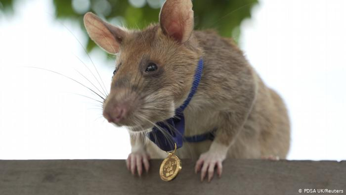

# Magawa

> A minesweeper clone.

---

## Trivia

This game is named after the giant pouched rat Magawa, who received a gold medal
in september 2020 for its success and bravery in clearing mine fields in
Cambodia.

## License and Author

MIT, 2020 Simon Lepel, simbo@simbo.de, https://simbo.de
